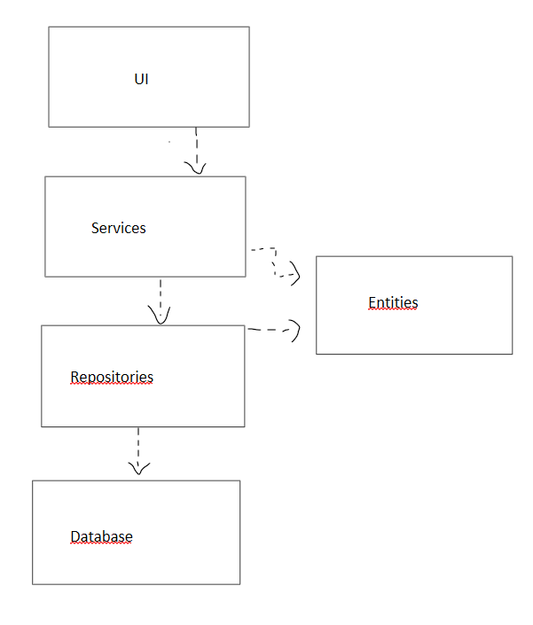
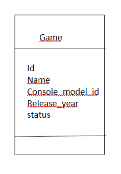

# Arkkitehtuurikuvaus
---
## Rakenne
---

Ohjelmiston rakenne noudattaa nelitasoista kerrosarkkitehtuuria, jossa käyttöliittymä, sovelluslogiikka, tietojen käsittely ja tietokanta on eroteltu omiin kokonaisuuksiinsa. Lisäksi sovellus sisältää erillisen luokan, joka kuvaa yksittäisen pelin tiedot
Koodin pakkausrakenne:

Pakkaus ui sisältää sovelluksen käyttöliittymän, pakkaus services sisältää sovelluslogiikan ja vastaa toimintojen käsittelystä, pakkaus repositories huolehtii tietojen tallentamisesta ja hakemisesta tietokannasta, pakkaus entities sisältää Game‑luokan joka toimii pelin tietorakenteena, ja tietokanta tallentaa pysyvästi kaikki sovelluksen käyttämät tiedot.

## Käyttöliittymä
---
Käyttöliittymä sisältää kuusi erillistä näkymää:
* Etusivu, mistä pääsee tarkastelemaan omaa kirjastoa tai lisäämään pelin
* Toivelista, mihin lisätty pelit, mitä käyttäjä toivoo pääsevän pelaamaan
* Tällä hetkellä pelattavat pelit
* Pelatut pelit, mihin käyttäjä pääsee antamaan arvion pelatulle pelille
* Haku peleille
* Sekä pelin lisäys

Kukin näistä näkymistä on toteutettu omana luokkanaan, ja käyttöliittymä näyttää niistä aina yhden kerrallaan. Näkymien vaihtamisesta ja sovelluksen yleisestä käyttöliittymälogiikasta vastaa UI‑luokka. Käyttöliittymä on eriytetty sovelluslogiikasta siten, että se ei sisällä pelien käsittelyyn liittyvää toiminnallisuutta, vaan ainoastaan kutsuu Services‑paketin tarjoamia metodeja. Aina kun pelikirjaston tila muuttuu esim. kun käyttäjä lisää uuden pelin käyttöliittymä pyytää palvelukerrokselta ajantasaisen listan näytettävistä peleistä ja rakentaa näkymän uudelleen sen perusteella.

## Sovelluslogiikka
---

Sovelluksen loogisen tietomallin muodostaa Game‑luokka, joka kuvaa käyttäjän lisäämiä pelejä ja niiden keskeisiä tietoja.

Sovelluksen toiminnallisuudesta vastaa services‑pakkaus, joka sisältää luokat GameService, ConsoleService, ConsoleModelService ja GenreService. Palveluluokat tarjoavat käyttöliittymän tarvitsemat toiminnot, kuten pelien lisäämisen, hakemisen ja suodattamisen. Pelin lisäämisen yhteydessä GameService tallentaa pelin perustiedot ja välittää valitut genret repository‑kerrokselle, joka tallentaa ne tietokantaan. Palvelukerros toimii rajapintana käyttöliittymän ja tietokannan välillä.

## Tietojen pysyväistallennus
---
