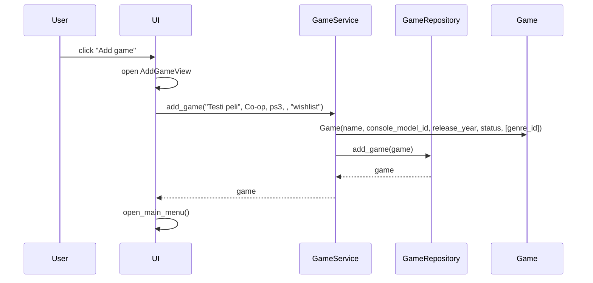

# Arkkitehtuurikuvaus
---
## Rakenne
---

Ohjelmiston rakenne noudattaa nelitasoista kerrosarkkitehtuuria, jossa käyttöliittymä, sovelluslogiikka, tietojen käsittely ja tietokanta on eroteltu omiin kokonaisuuksiinsa. Lisäksi sovellus sisältää erillisen luokan, joka kuvaa yksittäisen pelin tiedot
Koodin pakkausrakenne:

Pakkaus ui sisältää sovelluksen käyttöliittymän, pakkaus services sisältää sovelluslogiikan ja vastaa toimintojen käsittelystä, pakkaus repositories huolehtii tietojen tallentamisesta ja hakemisesta tietokannasta, pakkaus entities sisältää Game‑luokan joka toimii pelin tietorakenteena, ja tietokanta tallentaa pysyvästi kaikki sovelluksen käyttämät tiedot.

## Käyttöliittymä
---
Käyttöliittymä sisältää seitsemän erillistä näkymää:
* Etusivu, mistä pääsee tarkastelemaan omaa kirjastoa tai lisäämään pelin
* Toivelista, mihin lisätty pelit, mitä käyttäjä toivoo pääsevän pelaamaan
* Tällä hetkellä pelattavat pelit
* Pelatut pelit, mihin käyttäjä pääsee antamaan arvion pelatulle pelille
* Haku peleille
* Pelin lisäys
* Pelin arvostelu

Kukin näistä näkymistä on toteutettu omana luokkanaan, ja käyttöliittymä näyttää niistä aina yhden kerrallaan. Näkymien vaihtamisesta ja sovelluksen yleisestä käyttöliittymälogiikasta vastaa UI‑luokka. Käyttöliittymä on eriytetty sovelluslogiikasta siten, että se ei sisällä pelien käsittelyyn liittyvää toiminnallisuutta, vaan ainoastaan kutsuu Services‑paketin tarjoamia metodeja. Aina kun pelikirjaston tila muuttuu esim. kun käyttäjä lisää uuden pelin käyttöliittymä pyytää palvelukerrokselta ajantasaisen listan näytettävistä peleistä ja rakentaa näkymän uudelleen sen perusteella.

## Sovelluslogiikka
---

Sovelluksen loogisen tietomallin muodostaa Game‑luokka, joka kuvaa käyttäjän lisäämiä pelejä ja niiden keskeisiä tietoja.

Sovelluksen toiminnallisuudesta vastaa services‑pakkaus, joka sisältää luokat GameService, ConsoleService, ConsoleModelService ja GenreService. Palveluluokat tarjoavat käyttöliittymän tarvitsemat toiminnot, kuten pelien lisäämisen, hakemisen ja suodattamisen. Pelin lisäämisen yhteydessä GameService tallentaa pelin perustiedot ja välittää valitut genret repository‑kerrokselle, joka tallentaa ne tietokantaan. Palvelukerros toimii rajapintana käyttöliittymän ja tietokannan välillä.

## Tietojen pysyväistallennus
---

Sovelluksen pysyväistallennuksesta vastaa repositories‑pakkaus, joka sisältää neljä luokkaa:
- GameRepository: tallentaa ja hakee pelit sekä niiden arvosanat
- ConsoleRepository: tallentaa ja hakee konsolit
- ConsoleModelRepository: tallentaa ja hakee konsolimallit
- GenreRepository: tallentaa ja hakee genret sekä pelien genre‑suhteet
Kaikki repositoriot käyttävät SQLite‑tietokantaa, ja ne tarjoavat sovelluslogiikalle yhtenäisen rajapinnan datan käsittelyyn.

Tietokannan taulut luodaan initialize_database.py‑tiedostossa, jossa määritellään rakenteet peleille, konsoleille, konsolimalleille ja genreille.

## Päätoiminnallisuudet
---

Kuvataan sekvenssikaaviona joiltain osin sovelluksen toimintalogiikkaa.

### Pelin lisääminen

Kun käyttäjä on avannut sovelluksen hänelle avautuu pääikkuna näkymä. Jos hän haluaa lisätä pelin "Add game" kohdasta hänelle avautuu näkymä lomake missä on kentät: nimi, genre, console, console model, julkaisuvuosi (valinnainen) ja status. Kun käyttäjä täyttää kentät ja lähettää lomakkeen, käyttöliittymä välittää annetut tiedot sovelluslogiikalle, joka käsittelee ne ja kutsuu taustalla toimivaa GameRepository‑luokkaa. Repository tallentaa pelin tiedot tietokantaan ja lisää samalla pelin ja valittujen genrejen väliset suhteet. Tallennuksen jälkeen sovellus palaa takaisin käyttöliittymään ja päivittää pelilistan, jolloin käyttäjä näkee juuri lisäämänsä pelin omassa kirjastossaan.

Kun käyttäjä klikkaa päävalikossa “Add game”, käyttöliittymä avaa AddGameView‑näkymän. Näkymässä käyttäjä syöttää pelin tiedot. Genre‑ ja konsolivalinnat haetaan valmiiksi tietokannasta palvelukerroksen kautta. Kun käyttäjä painaa “Add Game”, käyttöliittymä kutsuu sovelluslogiikan metodia
game_service.add_game(name, console_model_id, release_year, status, genre_id).
game_service muodostaa Game‑olion ja välittää sen GameRepositorylle tallennettavaksi.
Tallennuksen jälkeen game_service palauttaa pelin tunnisteen käyttöliittymälle.
Jos käyttäjä valitsee statukseksi wishlist tai playing, käyttöliittymä kutsuu omaa metodiaan open_main_menu(), jolloin käyttäjä palaa takaisin päävalikkoon.
