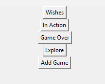
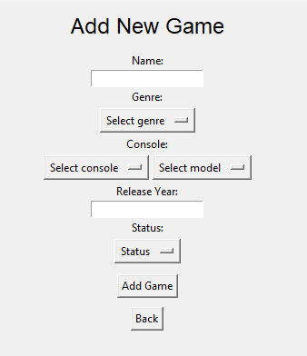

# Käyttöohje - GameLibrary
---
1. Lataa projektin lähdekoodi GitHubista
2. Varsinainen sovellus sijaitsee Game-library‑hakemistossa.
   Ennen kuin suoritat mitään Poetry‑komentoja, siirry oikeaan hakemistoon:
   cd Game-library

Kaikki seuraavat komennot suoritetaan Game-library‑kansiossa.
3. Asenna riippuvuudet komennolla:
```poetry install```

- Alusta tietokanta komennolla:
```poetry run invoke build```

- Käynnistä sovellus:
```poetry run invoke start```

Huom. sovellus testattu python 3.12 -versiolla, tätä uudemmilla versioilla aiheuttaa virheen. Tarv. asenna sopiva python versio.
## Sovelluksen käynnistäminen
---
Sovellus käynnistyy Tkinter‑ikkunaan.
Päävalikossa näkyvät seuraavat toiminnot:



## Pelin lisääminen
---
Valitse päävalikosta Add Game.
Täytä seuraavat tiedot:

Pelin nimi
Genre
Konsoli (PlayStation, Xbox, Nintendo, PC)
Konsolimalli (esim. PS4, PS5, Switch…)
Julkaisuvuosi (voi jättää tyhjäksi)
Status: Wish to Play, Playing, Played
Lopuksi paina Add Game.
Peli tallentuu tietokantaan ja näkyy oikeassa kirjastossa.



## Pelin statuksen muuttaminen
---
Pelin statusta voi muuttaa:
Playing / Wish to Play -näkymissä
Valitse peli listasta
Paina joko Move to Playing tai Move to Played

## Pelin arvosteleminen
---
Jos pelin status vaihdetaan played pelin lisäämisen jälkeen:
Siirry Played‑näkymään
Valitse peli
Paina Rate Game
Arvostele peli neljällä osa‑alueella: Story, Graphics, Gameplay, Overall
Arvostelut tallentuvat tietokantaan.

Jos pelin status on suoraan completed, arvostelu ikkuna avautuu käyttäjälle heti

## Pelien hakeminen
---
Valitse päävalikosta explore.
Voit hakea joko pelin nimellä tai suodattaa konsolin tai genren perusteella
