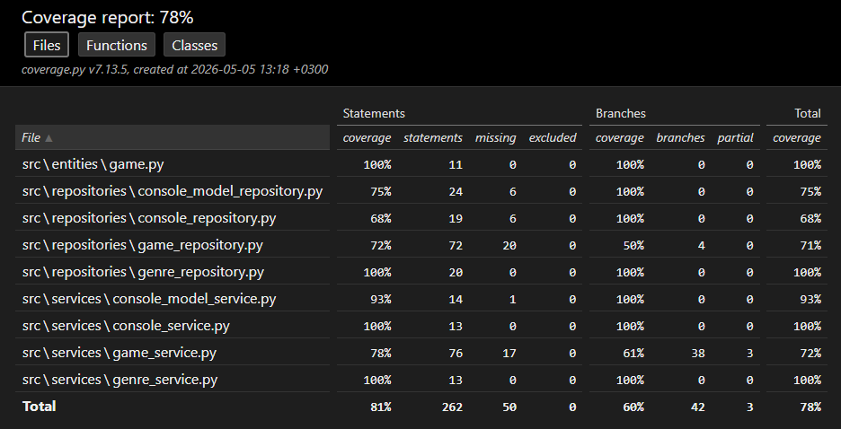

# Testausdokumentti
---
Sovellusta on testattu sekä automatisoiduin unittest‑pohjaisia yksikkö- ja integraatiotesteillä että käyttöliittymän kautta tehdyillä manuaalisilla kokeiluilla.

## Yksikkö- ja integraatiotestaus
---
### Sovelluslogiikka

Sovelluslogiikan toiminnallisuutta testataan erillisillä testiluokilla, joissa jokaiselle palveluluokalle (GameService, ConsoleService, ConsoleModelService, GenreService) on oma testitiedostonsa. Testeissä palveluluokille annetaan käyttöön “fake”‑repositoryt, jotka tallentavat tiedot muistiin tietokannan sijaan. Näin voidaan varmistaa, että palveluluokkien logiikka toimii oikein ilman riippuvuutta tietokantakerrokseen. Testit kattavat mm. pelien lisäämisen, hakemisen, tilan muuttamisen ja poistamisen.

### Repositorio-luokat

Repositorio‑luokkia (GameRepository, ConsoleRepository, ConsoleModelRepository, GenreRepository) testataan erillisillä testitiedostoilla käyttäen erillistä testitietokantaa. Testeissä tietokanta alustetaan aina muistiin, ja taulut luodaan ennen jokaista testiä. Testit varmistavat, että tietojen tallennus, haku, poistaminen ja liitostaulujen käsittely toimivat oikein. Jokaiselle repositoriolle on oma testiluokkansa, jossa testataan sen keskeiset toiminnot.

### Testauskattavuus

Sovelluksen testauskattavuus on 78%. Kattavuusraportti on generoitu coverage.py‑työkalulla, ja se kattaa sekä palvelukerroksen että repositoriokerroksen.

Kattavuus jakautuu seuraavasti:

## Järjestelmätestaus
---

Sovelluksen järjestelmätestaus on suoritettu manuaalisesti käyttöliittymän kautta.

### Asennus ja konfigurointi

Sovellus on asennettu ja sitä on testattu käyttöohjeen kuvaamalla tavalla Windows -ja Linux-ympäristössä Poetry‑työkalun avulla.
Sovellusta on testattu tilanteissa, joissa tietokantaa ei ole olemassa sekä missä tietokanta sisältää valmiiksi dataa. Näin on varmistettu, että sovellus toimii luotettavasti sekä puhtaassa asennuksessa että olemassa olevassa ympäristössä.

## Sovellukseen jääneet laatuongelmat
---

* Käyttäjän tulee itse muistaa alustaa tietokanta
* Peliä ei saa lisättyä kuin aloitusnäkymästä
* Jos käyttäjä vahingossa lisää pelin pelattuihin, niin tätä ei ole mahdollista siirtää oikeaan paikkaan vaan koko peli tulee poistaa ja lisätä uudelleen
* Käyttäjä ei voi muokata lisättyä peliä. Vaan joutuu poistamaan ja lisäämään kokonaan pelin uudelleen.
