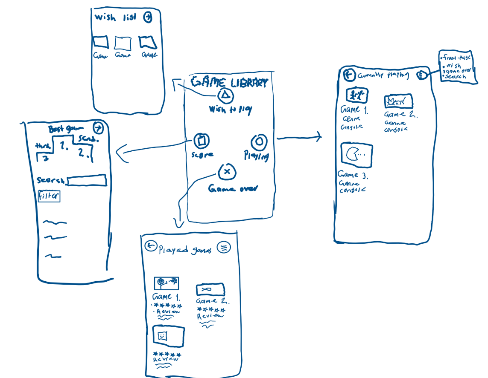

# Vaatimusmäärittely
---
## Sovelluksen tarkoitus
---
Sovelluksen avulla käyttäjä voi pitää kirjaa pelaamistaan peleistä, peleistä joita hän suunnittelee pelaavansa sekä peleistä, joita hän parhaillaan pelaa. Sovellus on käyttäjäkohtainen, eikä se sisällä rekisteröitymistä tai kirjautumista. Käyttäjä voi lisäksi hakea kirjastoonsa lisäämiä pelejä ja tarkastella erillistä näkymää, jossa näytetään hänen antamiensa arvioiden perusteella top 3 ‑peliä.

## Käyttäjät
---
Alkuvaiheessa sovelluksella on vain yksi käyttäjärooli. Sovellusta käyttää yksi henkilö omalla koneellaan, eikä kirjautumista tai käyttäjätilien hallintaa ole. Kaikki tiedot tallennetaan paikallisesti käyttäjän omaan pelikirjastoon.

## Käyttöliittymäluonnos
---
Sovellus koostuu viidestä eri näkymästä: etusivu, toivelista, pelatut pelit, meneillään olevat pelit sekä hakusivu, jossa näytetään myös käyttäjän top 3 ‑pelit arvioiden perusteella.

## Perusversion tarjoama toiminnallisuus
---

### Alkutila
 * Käyttäjä voi lisätä pelejä manuaalisesti kolmeen eri kategoriaan: toivelistaan, meneillään oleviin peleihin tai pelattuihin peleihin.
 * Käyttäjä voi poistaa lisäämänsä pelin tarvittaessa.
 * Käyttäjä voi liittää peliin pienen kansikuvan tai avatarin, jotta pelikirjasto on visuaalisesti selkeämpi ja peleistä on helpompi saada nopeasti kiinni.

### Kirjaston ylläpitäminen
 * Käyttäjä voi siirtää pelin kategoriasta toiseen, esimerkiksi meneillään olevista peleistä pelattuihin.

* Kun peli siirretään pelattuihin, käyttäjä voi antaa pelille arvostelun eri osa‑alueista mm. visuaalisuus, tarina, pelattavuus ja yleisarvosana.

* Käyttäjä voi hakea kirjastoonsa lisäämiä pelejä nimen perusteella.

* Hakusivulla näytetään myös käyttäjän antamien arvioiden perusteella top 3 ‑peliä.

* Sovellus tarjoaa valmiin listan peligenreistä sekä alustoista (konsolit/PC), joista käyttäjä voi valita peliä lisätessään.

* Pelejä voi hakea ja suodattaa myös genren ja alustan perusteella.

* Top‑3‑lista päivittyy automaattisesti aina, kun käyttäjä muuttaa jonkin pelin arvosanaa.

## Jatkokehitysideoita
---
Perusversion jälkeen järjestelmää voidaan kehittää esimerkiksi seuraavilla toiminnallisuuksilla:

* Käyttäjätunnusten luominen ja kirjautuminen, jolloin useampi käyttäjä voisi ylläpitää omaa pelikirjastoaan.

* Mahdollisuus tarkastella muiden käyttäjien pelikirjastoja (esim. web‑versiossa).

* Pelisuositukset sen perusteella, mitä muut käyttäjät ovat arvioineet samoista peleistä, joita käyttäjä itse on pelannut.

* Sovelluksen laajentaminen web‑sovellukseksi, jossa käyttäjät voivat jakaa ja vertailla pelikirjastojaan.

* Mahdollisuus lisätä peleihin lisätietoja, kuten julkaisuvuosi, kehittäjä tai pelin kansikuva.

* Sovellukseen voi myös lisätä keskitetyn pelitietokannan, jota kaikki käyttäjät hyödyntävät. Tällöin pelit valittaisiin valmiista listasta, mikä vähentäisi kirjoitusvirheitä ja varmistaisi, että sama peli viittaa aina samaan tietueeseen. Yhteinen tietokanta estäisi myös epäsiistin tai sopimattoman sisällön lisäämisen ja mahdollistaisi laajemmat suositukset ja vertailut käyttäjien välillä.
