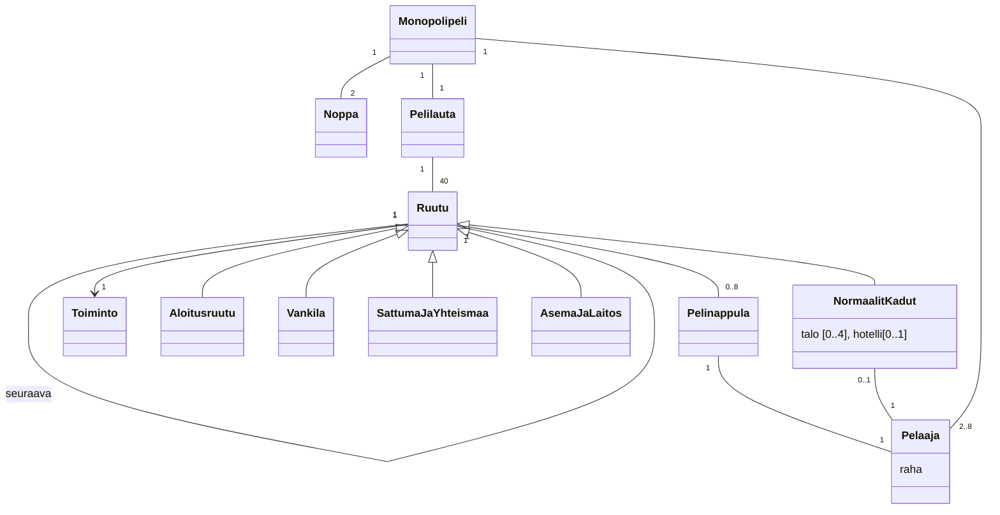

```mermaid
 classDiagram
    Monopolipeli "1" -- "2" Noppa
    Monopolipeli "1" -- "1" Pelilauta
    Pelilauta "1" -- "40" Ruutu
    Ruutu "1" -- "1" Ruutu : seuraava
    Ruutu "1" -- "0..8" Pelinappula
    Pelinappula "1" -- "1" Pelaaja
    Pelaaja "2..8" -- "1" Monopolipeli
    %% minun täydennys alkaa
    Ruutu "1" --> "1" Toiminto
    Ruutu <|-- Aloitusruutu
    Ruutu <|-- Vankila
    Ruutu <|-- SattumaJaYhteismaa
    Ruutu <|-- AsemaJaLaitos
    Ruutu <|-- NormaalitKadut
    NormaalitKadut "0..1" -- "1" Pelaaja
    class Pelaaja {raha}
    class NormaalitKadut {talo [0..4], hotelli[0..1]}

```